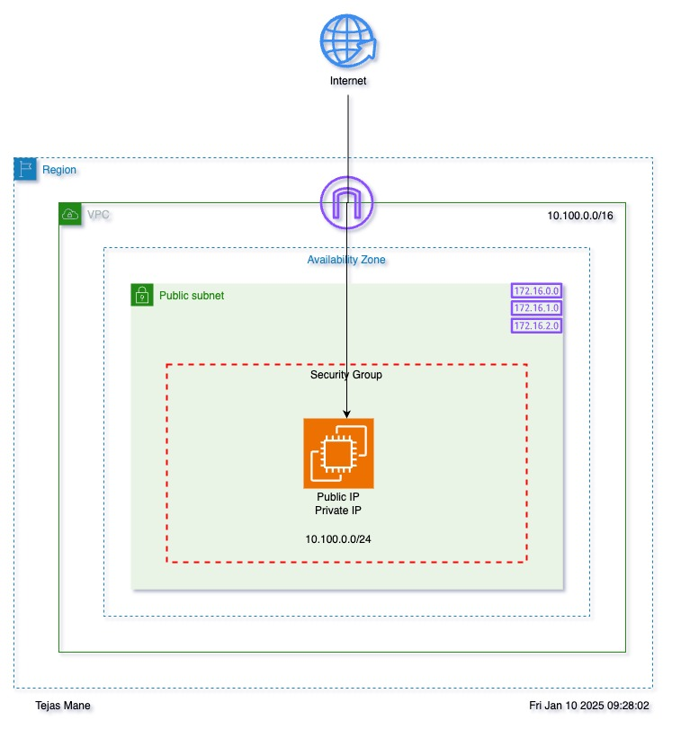
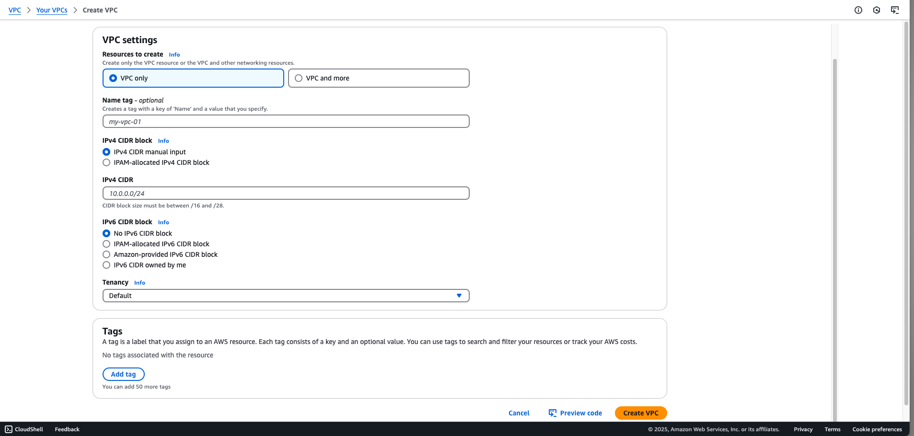
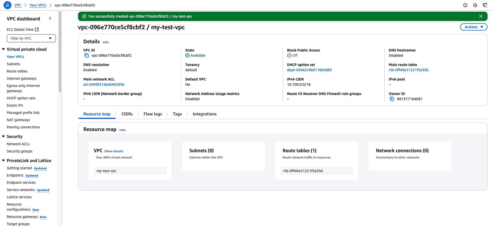
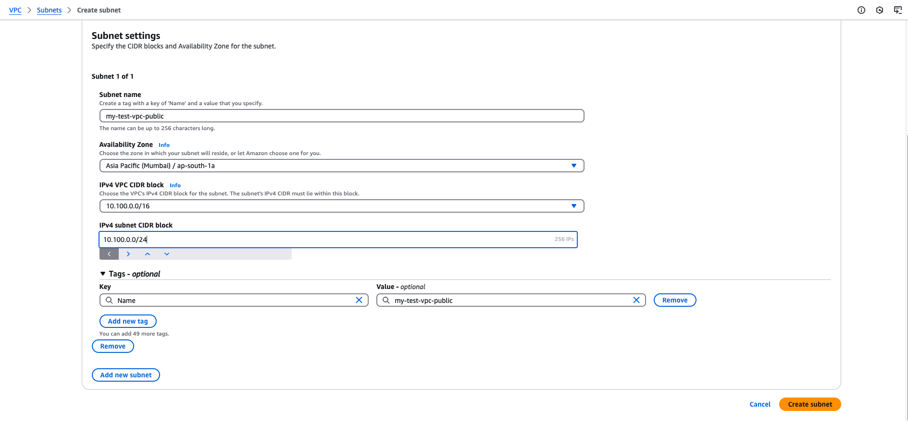
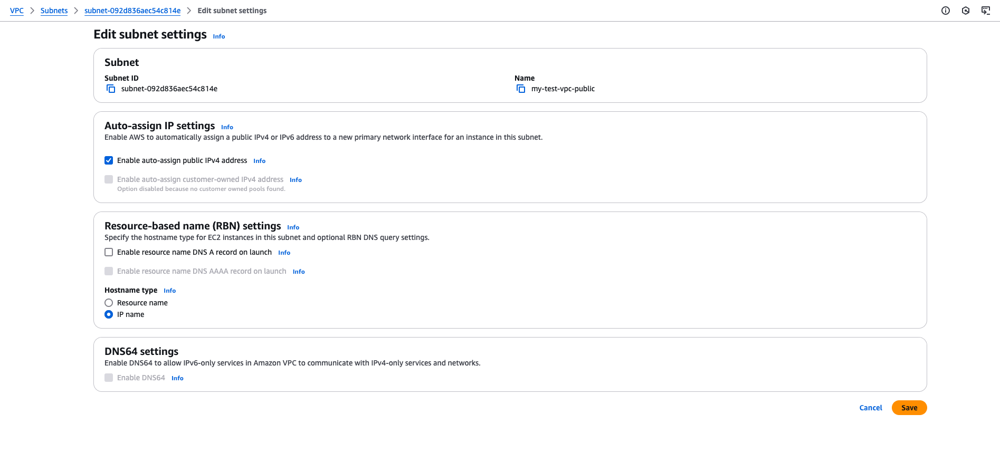
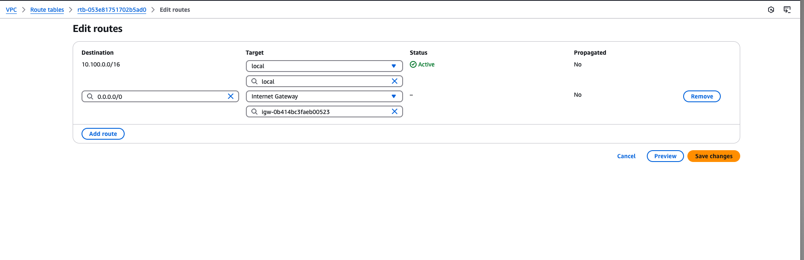
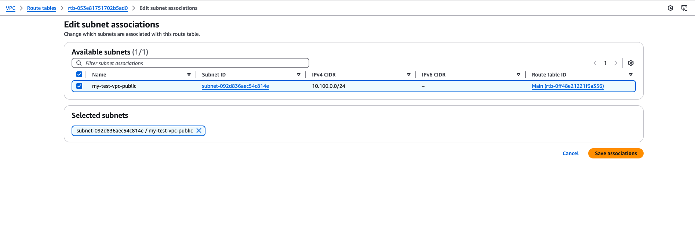
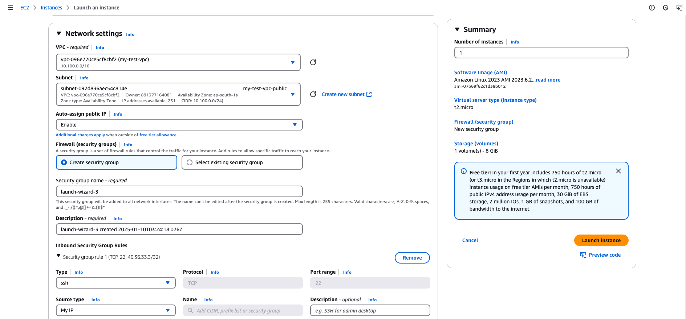

# Project Name: VPC Public Subnet

## Architecture


## Overview

This project demonstrate the creation of a VPC with a public subnet and enabling communication over the internet.

---

## Steps

### 1. **Create VPC**
- **Region:** Mumbai (ap-south-1)
- Go to the **VPC** service and select **Your VPCs**.
- Click on **Create VPC**.
  - **Name:** `my-test-vpc`
  - **CIDR:** `10.100.0.0/16`




---

### 2. **Create Internet Gateway**
- Navigate to **Internet Gateway**.
- Click on **Create Internet Gateway**.
- **Name:** `test-igw`

---

### 3. **Attach Internet Gateway to VPC**
- Select the created Internet Gateway.
- Click on **Actions** → **Attach to VPC**.
- Choose **my-test-vpc** and attach.

---

### 4. **Create Subnet**
- Navigate to **Subnets** and click on **Create Subnet**.
  - **Name:** `my-test-vpc-public`
  - **VPC:** `my-test-vpc`
  - **Availability Zone (AZ):** `ap-south-1a`
  - **CIDR:** `10.100.0.0/24`



- After creation, select the Subnet → **Actions** → **Edit Subnet Settings**.
- Under **Auto-assign IP settings**, enable **Auto-assign public IPv4 address**.



---

### 5. **Create Route Table**
- Navigate to **Route Tables** and click on **Create Route Table**.
  - **Name:** `my-test-vpc-public-rt`
  - **VPC:** `my-test-vpc`
- After creation, go to **Routes** → **Edit Routes**.
  - Add the following route:
    - **Destination:** `0.0.0.0/0`
    - **Target:** Select **Internet Gateway** (e.g., `igw-xxx`).
- Save the changes.



---

### 6. **Associate Route Table with Subnet**
- Select the created Route Table.
- Navigate to **Subnet Associations** → **Edit Subnet Associations**.
- Select the **my-test-vpc-public** subnet and save.


---

### 7. **Launch EC2 Instance**
- Go to the **EC2** service → **Instances** → **Launch Instances**.
- Select the following:
  - **AMI:** Amazon Linux 2
  - **Instance Type:** `t2.micro`
  - **VPC:** `my-test-vpc`
  - **Subnet:** `my-test-vpc-public`
  - **Key Pair:** Select an existing or create a new key pair.
  - **Security Group:** Add a rule for **SSH (port 22)** with **Source:** MyIP.
- Review and launch the instance.

---

### 8. **Connect to EC2 Instance**
- Use the instance's **Public IP** to connect via your terminal:
  ```bash
  ssh -i <your-key.pem> ec2-user@<public-ip>
  ```